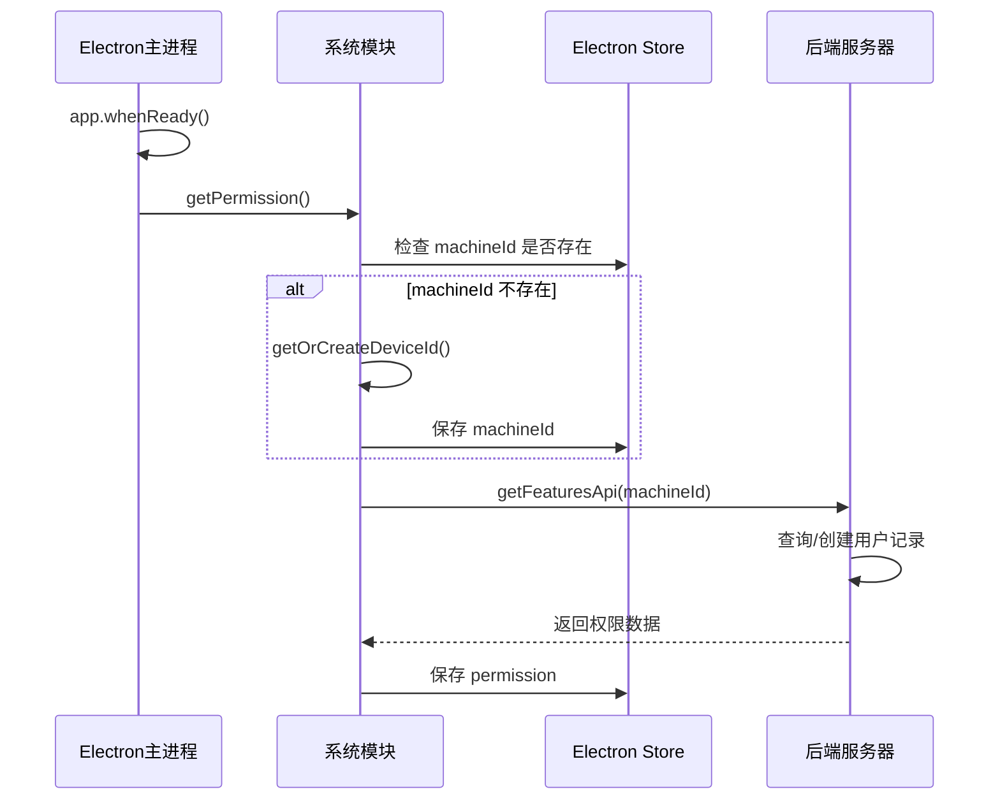
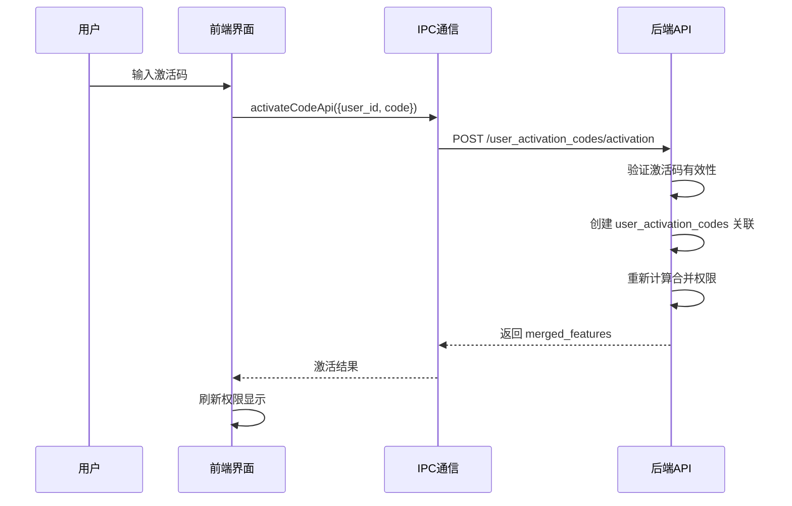
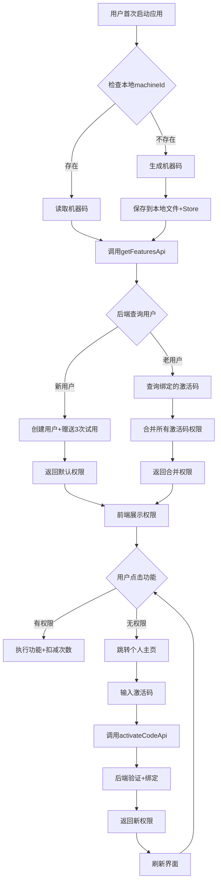
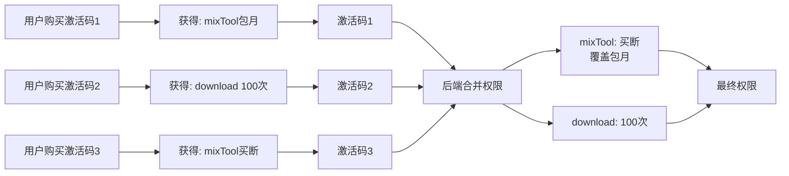

# 机器码注册与权限管理系统需求文档

## 📋 一、需求概述

### 1.1 项目背景
video-box（视频黑盒/Inspiro）是一个基于 Electron 的桌面端音视频批量创作工具。为了保护软件版权和实现商业化运营，需要建立一套完善的机器码注册与权限管理系统。

### 1.2 核心目标
- **一机一码**：每台设备生成唯一的机器码作为用户身份标识
- **无需注册**：用户无需传统账号注册流程，直接使用机器码登录
- **权限控制**：基于激活码的功能权限管理体系
- **灵活计费**：支持次数、包月、包年、买断制等多种授权模式
- **叠加使用**：支持多个激活码叠加，智能合并权限

---

## 🔑 二、机器码管理

### 2.1 机器码生成规则

#### 2.1.1 生成策略
```javascript
// 优先级顺序：
1. 尝试获取系统硬件ID（node-machine-id）
2. 如果失败，使用 UUID v4 生成
3. 持久化存储到本地文件 device-id.txt
```

#### 2.1.2 存储位置
- **文件路径**：`app.getPath('userData')/device-id.txt`
- **Electron Store**：`machineId` 键值
- **特性**：首次生成后永久不变，确保设备唯一性

#### 2.1.3 代码实现
```javascript
// electron/utils/system/index.js
function getOrCreateDeviceId() {
  const userDataPath = app.getPath('userData');
  const idFilePath = path.join(userDataPath, 'device-id.txt');

  // 如果文件已存在，读取
  if (fs.existsSync(idFilePath)) {
    return fs.readFileSync(idFilePath, 'utf8');
  }

  let id;
  try {
    // 尝试获取机器码
    id = machineIdSync({ original: true });
  } catch (e) {
    // 如果失败，使用 UUID
    id = uuidv4();
  }

  // 写入文件
  fs.writeFileSync(idFilePath, id, 'utf8');
  return id;
}
```

### 2.2 机器码初始化流程

#### 2.2.1 应用启动阶段


#### 2.2.2 关键代码位置
- **主进程入口**：`main.js` Line 243
- **权限获取函数**：`electron/utils/permission/index.js`
- **IPC初始化**：`electron/utils/initIpc/index.js` → `initPermission()`

---

## 🔐 三、权限管理体系

### 3.1 权限类型定义

| 类型 | 标识符 | 说明 | 数据结构示例 |
|------|--------|------|-------------|
| 次数 | `count` | 按使用次数计费 | `{type: "count", remaining: 100}` |
| 包月 | `monthly` | 按月订阅 | `{type: "monthly", expireDate: "2025-06-14"}` |
| 包年 | `yearly` | 按年订阅 | `{type: "yearly", expireDate: "2026-01-01"}` |
| 买断 | `lifetime` | 永久有效 | `{type: "lifetime"}` |

### 3.2 功能模块映射

| 功能关键字 | 中文名称 | 说明 |
|-----------|---------|------|
| `match` | 图片匹配成片 | AI图文生成视频 |
| `mixTool` | 混剪工具 | 自动混剪功能 |
| `download` | 聚合视频下载 | 多平台视频下载 |
| `tts` | 文字转语音 | TTS配音服务 |
| `vtt` | 语音转字幕 | ASR字幕生成 |

### 3.3 权限数据结构

```json
{
  "code": 1,
  "data": {
    "machineId": "8a7d2f9e1c-b5c3a8d0e7",
    "features": {
      // 功能权限数据 
      "mixTool": {
        "type": "monthly",
        "expireDate": "2025-06-14"
      },
      "download": {
        "type": "count",
        "remaining": 100
      },
      "match": {
        "type": "lifetime"
      }
    }
  }
}
```

---

## 🎫 四、激活码系统

### 4.1 激活码叠加机制

#### 4.1.1 核心原则
- **永久 > 订阅 > 次数**：权限优先级递减
- **同类取优**：同类型权限保留最优值
- **次数累加**：多次激活的次数类型可叠加（取最大值）

#### 4.1.2 合并算法
```javascript
function mergeFeatures(codes) {
  const order = { lifetime: 3, yearly: 2, monthly: 2, count: 1 };
  const merged = {};
  
  codes.forEach((code) => {
    Object.entries(code.features).forEach(([feature, permission]) => {
      const current = merged[feature];
      
      if (
        !current ||
        order[permission.type] > order[current.type] ||
        (permission.type === 'count' && 
         current.type === 'count' && 
         permission.remaining > current.remaining)
      ) {
        merged[feature] = { ...permission };
      }
    });
  });
  
  return merged;
}
```

### 4.2 激活流程



---

## 🌐 五、接口调用规范

### 5.1 客户端 → 后端接口

#### 5.1.1 获取用户权限
**接口路径**：`GET /activation_codes/features`

**请求参数**：
```javascript
{
  machineId: string  // 机器码
}
```

**响应数据**：
```javascript
{
  code: 1,  // 1成功，其他失败
  data: {
    machineId: string,
    features: {
      [featureKey]: {
        type: "count" | "monthly" | "yearly" | "lifetime",
        remaining?: number,  // 仅count类型
        expireDate?: string  // 仅订阅类型
      }
    }
  }
}
```

**调用方式**：
```javascript
// 前端调用
const result = await ipcRenderer.invoke('getFeaturesApi', {
  machineId: await ipcRenderer.invoke('store', 'get', 'machineId')
});
```

**后端处理逻辑**：
1. 查询 `users_codes` 表是否存在该机器码
2. 不存在则创建新用户，默认赋予各功能3次试用权限
3. 查询用户绑定的所有激活码（`user_activation_codes`）
4. 合并所有激活码的权限（`mergeFeatures`）
5. 返回合并后的权限数据

---

#### 5.1.2 激活码激活
**接口路径**：`POST /user_activation_codes/activation`

**请求参数**：
```javascript
{
  user_id: string,   // 机器码
  code: string       // 激活码
}
```

**响应数据**：
```javascript
{
  code: 1,  // 1成功，其他失败
  msg: string,  // 提示信息
  data: {
    merged_features: object  // 合并后的权限
  }
}
```

**调用方式**：
```javascript
const result = await ipcRenderer.invoke('activateCodeApi', {
  user_id: machineCode,
  code: activationCode
});
```

**后端处理逻辑**：
1. 验证激活码是否存在且未过期
2. 检查是否已激活过该码（防止重复）
3. 在 `user_activation_codes` 表创建关联记录
4. 重新计算用户的所有激活码权限并合并
5. 返回最新的合并权限

---

#### 5.1.3 更新使用次数
**接口路径**：`POST /user_codes/updateFeaturesCount`

**请求参数**：
```javascript
{
  id: string,           // 机器码
  featuresKeyword: string  // 功能关键字（如 "mixTool"）
}
```

**响应数据**：
```javascript
{
  code: 1,
  data: {
    remaining: number  // 剩余次数
  }
}
```

**调用时机**：每次使用次数类型的功能时调用

**后端处理逻辑**：
1. 查找用户所有激活码中该功能的次数类型记录
2. 找到剩余次数最多的那条记录
3. 扣减1次并更新数据库
4. 返回最新剩余次数

---

### 5.2 Electron IPC 通信接口

#### 5.2.1 Store 操作
```javascript
// 获取机器码
const machineId = await ipcRenderer.invoke('store', 'get', 'machineId');

// 保存机器码
await ipcRenderer.invoke('store', 'set', 'machineId', newMachineId);
```

#### 5.2.2 权限相关
```javascript
// 获取权限（包含自动创建用户）
const permission = await ipcRenderer.invoke('getFeaturesApi', { machineId });

// 激活码激活
const result = await ipcRenderer.invoke('activateCodeApi', {
  user_id: machineId,
  code: activationCode
});
```

**IPC注册位置**：
- `electron/utils/request/initRequestIpc.js` - 注册 API 调用
- `electron/utils/permission/initPermission.js` - 注册权限获取

---

## 💻 六、前端实现

### 6.1 个人主页界面

**文件路径**：`src/pages/Homes/PersonalHomepage/index.jsx`

**核心功能**：
1. 显示机器码（支持一键复制）
2. 展示当前权限列表
3. 激活码输入弹窗
4. 购买激活码入口（跳转到 https://faka.itclass.top/）
5. 刷新权限按钮

**权限展示逻辑**：
```javascript
const dealUserData = {
  machineCode: result.data.machineId,
  permissions: Object.entries(result.data.features).map(([key, val]) => {
    let typeZh = '';
    let value = null;

    switch (val.type) {
      case 'count':
        typeZh = '次数';
        value = `${val.remaining}次`;
        break;
      case 'monthly':
        typeZh = '包月';
        value = `有效期至 ${val.expireDate}`;
        break;
      case 'yearly':
        typeZh = '包年';
        value = `有效期至 ${val.expireDate}`;
        break;
      case 'lifetime':
        typeZh = '买断制';
        value = '永久有效';
        break;
    }

    return {
      name: nameMap[key] || key,
      type: typeZh,
      value,
    };
  }),
};
```

### 6.2 权限校验流程

```javascript
// 功能使用前校验
async function checkPermission(featureKey) {
  // 1. 从 store 获取缓存的权限
  const permission = await ipcRenderer.invoke('store', 'get', 'permission');
  
  // 2. 检查功能是否存在
  const feature = permission?.data?.features?.[featureKey];
  
  if (!feature) {
    message.error('您没有该功能的使用权限');
    navigate('/personal-homepage');
    return false;
  }
  
  // 3. 根据类型判断
  if (feature.type === 'lifetime') {
    return true;
  }
  
  if (feature.type === 'monthly' || feature.type === 'yearly') {
    const now = new Date();
    const expire = new Date(feature.expireDate);
    if (now <= expire) {
      return true;
    } else {
      message.error('您的订阅已过期');
      navigate('/personal-homepage');
      return false;
    }
  }
  
  if (feature.type === 'count') {
    if (feature.remaining > 0) {
      // 调用后端扣减次数
      await ipcRenderer.invoke('updateUserCountApi', {
        id: machineId,
        featuresKeyword: featureKey
      });
      return true;
    } else {
      message.error('使用次数已耗尽');
      navigate('/personal-homepage');
      return false;
    }
  }
}
```

---

## 🗄️ 七、数据库设计

### 7.1 核心表结构

#### 7.1.1 users_codes（用户表）
| 字段 | 类型 | 说明 |
|------|------|------|
| id | VARCHAR(64) | 机器码（主键） |
| created_at | DATETIME | 创建时间 |
| updated_at | DATETIME | 更新时间 |

#### 7.1.2 activation_codes（激活码表）
| 字段 | 类型 | 说明 |
|------|------|------|
| code | VARCHAR(64) | 激活码（主键） |
| features | JSON | 权限定义 |
| status | TINYINT | 状态（0禁用 1启用） |
| created_at | DATETIME | 创建时间 |

**features 字段示例**：
```json
{
  "mixTool": {"type": "monthly", "expires": "2025-06-14"},
  "download": {"type": "count", "remaining": 100},
  "match": {"type": "lifetime"}
}
```

#### 7.1.3 user_activation_codes（用户-激活码关联表）
| 字段 | 类型 | 说明 |
|------|------|------|
| id | INT | 自增主键 |
| user_id | VARCHAR(64) | 外键 → users_codes.id |
| code | VARCHAR(64) | 外键 → activation_codes.code |
| activated_at | DATETIME | 激活时间 |

**联合唯一索引**：`(user_id, code)` 防止重复激活

---

## 🔒 八、安全性考虑

### 8.1 客户端安全
- ✅ 机器码持久化存储在本地文件 + Store 双重备份
- ✅ 每次功能调用都通过后端验证（不依赖本地缓存）
- ⚠️ 注意：前端权限缓存仅用于快速展示，实际校验在后端

### 8.2 服务端安全
- ✅ 激活码验证在服务端完成
- ✅ 次数扣减在服务端原子操作
- ✅ 防止重复激活（联合唯一索引）
- ✅ 激活码可设置有效期和状态

### 8.3 防破解措施
- ✅ 代码混淆：使用 `javascript-obfuscator`
- ✅ 关键逻辑在后端执行
- ✅ 机器码绑定硬件，难以伪造
- ⚠️ 建议：增加心跳检测、异常行为监控

---

## 📊 九、业务流程图

### 9.1 完整用户生命周期



### 9.2 激活码叠加流程



---

## 🧪 十、测试要点

### 10.1 功能测试
- [ ] 首次启动正确生成机器码
- [ ] 重启应用机器码保持不变
- [ ] 新用户自动获得3次试用权限
- [ ] 激活码激活成功并更新权限
- [ ] 无效激活码提示错误
- [ ] 重复激活同一码的处理
- [ ] 多个激活码叠加权限正确合并
- [ ] 次数类型功能使用后正确扣减
- [ ] 订阅过期后无法使用功能
- [ ] 机器码复制功能正常

### 10.2 边界测试
- [ ] 网络异常时的容错处理
- [ ] 后端接口超时处理
- [ ] 本地 Store 损坏恢复
- [ ] 机器码生成失败的降级方案
- [ ] 并发激活的处理

### 10.3 安全测试
- [ ] 修改本地 Store 无法绕过权限验证
- [ ] 伪造机器码无法获取他人权限
- [ ] 激活码爆破攻击防护
- [ ] SQL注入防护

---

## 📝 十一、相关文件清单

### 11.1 Electron 主进程
| 文件路径 | 作用 |
|---------|------|
| `main.js` | 应用入口，启动时调用 `getPermission()` |
| `electron/utils/system/index.js` | 机器码生成逻辑 `getOrCreateDeviceId()` |
| `electron/utils/permission/index.js` | 权限获取核心逻辑 `getPermission()` |
| `electron/utils/permission/initPermission.js` | 权限IPC注册 |
| `electron/utils/request/permission.js` | 后端API封装（getFeaturesApi, activateCodeApi） |
| `electron/utils/request/initRequestIpc.js` | API IPC注册 |
| `electron/utils/initIpc/index.js` | 统一IPC初始化入口 |
| `electron/store/index.js` | Electron Store配置 |

### 11.2 React 前端
| 文件路径 | 作用 |
|---------|------|
| `src/pages/Homes/PersonalHomepage/index.jsx` | 个人主页界面 |
| `src/pages/activateI/index.jsx` | 激活页面（备用） |
| `src/hook/usePermission.jsx` | 权限Hook（如有） |

### 11.3 文档
| 文件路径 | 作用 |
|---------|------|
| `docs/关于账号注册管理流程.md` | 注册流程说明 |
| `docs/开发进度日志0.1.2.md` | 开发日志 |
| `docs/激活码叠加使用流程.md` | 激活码叠加详细说明 |

---

## 🚀 十二、后续优化方向

### 12.1 性能优化
- [ ] 引入 Redis 缓存用户权限，减少数据库查询
- [ ] 前端权限缓存策略优化（TTL机制）
- [ ] 异步加载非关键权限数据

### 12.2 功能增强
- [ ] 支持机器码解绑/换绑功能
- [ ] 激活码批量导入
- [ ] 权限使用统计报表
- [ ] 离线模式支持（有限次数）
- [ ] 试用期倒计时提醒

### 12.3 安全加固
- [ ] 增加设备指纹多维度校验
- [ ] 异常登录检测
- [ ] 激活码使用地域限制
- [ ] 定期心跳检测在线状态
- [ ] 代码签名防止篡改

### 12.4 用户体验
- [ ] 激活成功动画效果
- [ ] 权限即将到期提醒
- [ ] 一键续费功能
- [ ] 权限对比引导升级
- [ ] 使用教程集成

---

## 📞 十三、技术支持

### 13.1 常见问题

**Q1: 用户重装系统后机器码会变吗？**
A: 会的。`node-machine-id` 基于硬件信息，重装系统可能改变。建议使用更稳定的硬件标识符组合。

**Q2: 虚拟机/云桌面如何处理？**
A: 虚拟环境的机器码可能不稳定，建议增加额外的设备指纹校验或改用账号体系。

**Q3: 如何防止用户共享激活码？**
A: 当前设计是一机一码，激活码与机器码绑定。如需多人使用，应设计团队版授权机制。

**Q4: 次数用完能否自动刷新？**
A: 可以设计"看广告得次数"或"签到得次数"等激励机制，需后端配合实现。

### 13.2 联系方式
- 技术负责人：[待补充]
- 后端接口文档：[待补充链接]
- 激活码销售平台：https://faka.itclass.top/

---

## 📅 十四、版本历史

| 版本 | 日期 | 更新内容 | 负责人 |
|------|------|---------|--------|
| v1.0 | 2025-01-XX | 初始版本，完成基础机器码+权限管理 | - |
| v1.1 | 2025-XX-XX | 增加激活码叠加机制 | - |

---

**文档维护者**: AI Assistant  
**最后更新**: 2026-04-21  
**文档状态**: ✅ 已完成

没有脚本的权限控制 ， 应该是脚本-具体脚本的控制 去掉脚本这一层

也就是说 scripts\soul\manifest.json直接取key 
举个列子：
{
  soul:{
    type:"count",
    remaining:3
  }
}

而不是
{
  script:{
    type:"count",
    remaining:3
  }
}

如果权限不够 直接弹窗提示